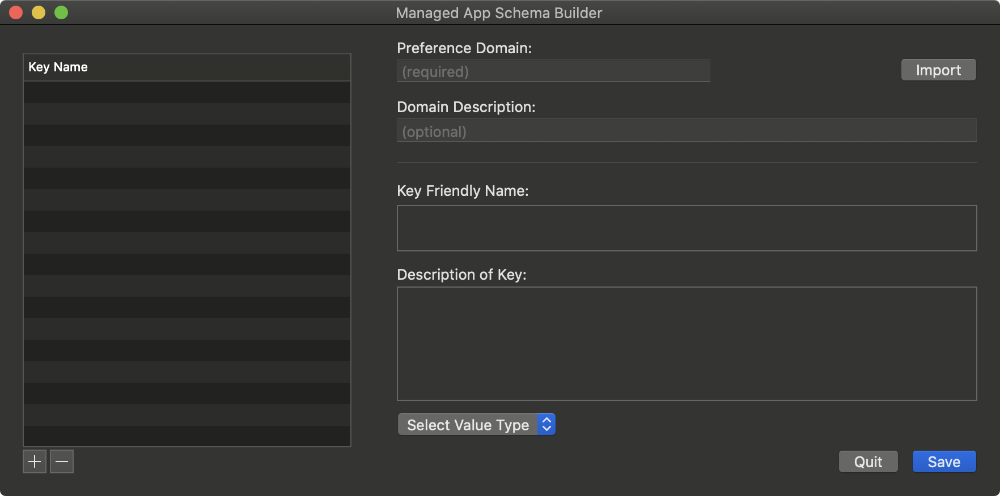

# Managed App Schema Builder

  
    

Download: [Managed App Schema Builder](https://github.com/BIG-RAT/Managed-App-Schema-Builder/releases/download/current/Managed.App.Schema.Builder.zip)

Starting with version 1.2.0 the application will submit basic hardware, OS, and Managed App Schema Builder application usage to [TelemetryDeck](https://telemetrydeck.com). The data is sent anamously and used to aid in the development of the application. To opt out of data the sending of data click 'Opt out of analytics' at the bottom of the 'About Managed App Schema Builder' window.

Before wasting time creating something that's already been done see if it's available:

* [https://github.com/ProfileCreator/ProfileManifests](https://github.com/ProfileCreator/ProfileManifests)

* [https://github.com/Jamf-Custom-Profile-Schemas/ProfileManifestsMirror](https://github.com/Jamf-Custom-Profile-Schemas/ProfileManifestsMirror)

Otherwise use the app to create a JSON file that can be used to set application preferences.  Then don't be shy, if it's new please share what you have crafted.

Starting with Jamf Pro v10.19 you are able to create a custom schema, in the form of a JSON, to create a template for setting application preferences within the Application & Custom Settings payload (Computer Configuration Profiles).

Consult the [Wiki](https://github.com/BIG-RAT/Managed-App-Schema-Builder/wiki) (which needs updating) for usage information.

___

Thanks @talkingmoose for all the help!