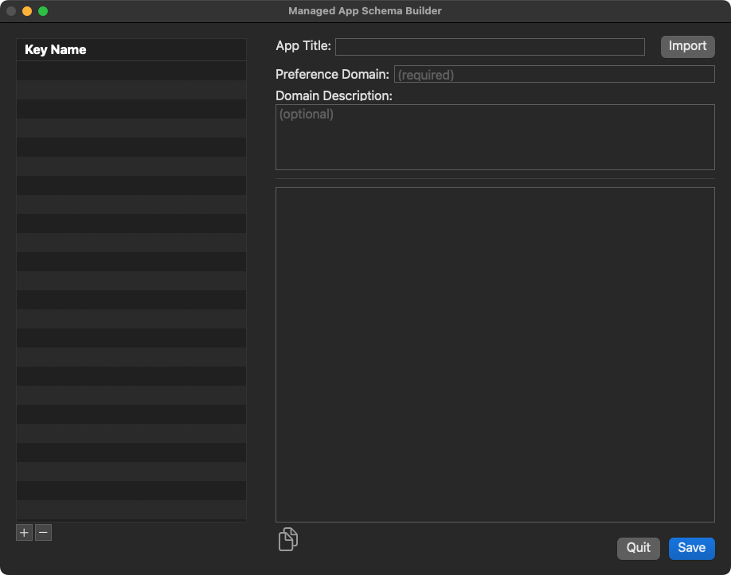

# Managed App Schema Builder
Creates JSON file that can be used to set application preferences

Download: [Managed App Schema Builder](https://github.com/BIG-RAT/Managed-App-Schema-Builder/releases/download/current/Managed-App-Schema-Builder.zip)

Starting with Jamf Pro v10.19 you are able up upload a JSON file to create a template for setting application preferences within the Application & Custom Settings payload (Computer Configuration Profiles).

#### Usage:
* Provide a preference domain, something like: com.jamf.JamfRemote
* Provide (optional) a description for the preference domain.
* Start by adding a preference key (plus sign towards the bottom left).
* Modify the Key Fiendly Name if desired.  This is what is displayed for the key within the Jamf Pro GUI.
* Provide (optional) a description of what the key does, what it applies to.  Perhaps descript the format of the data entered.
* Select the key type from the drop down menu.
* For 'integer (from list)', additional information can be entered.
	* Comma seperated list of options.  These will be items selectable from a menu. Quotes are not required when entering a menu choice and the choice cannot contain a comma in it.
	* Comma seperated list of integers.  This will be the integer value corresponding to the menu choice.
		

Once all the keys and values have been set click 'Save'.  The contents of the saved file will be copied to the clipboard.  This can then be pasted into the Schema field in the Jamf Pro server.

The saved JSON file can later be imported and modify.  Add/Update/Remove keys of change the description.

#### Important:
